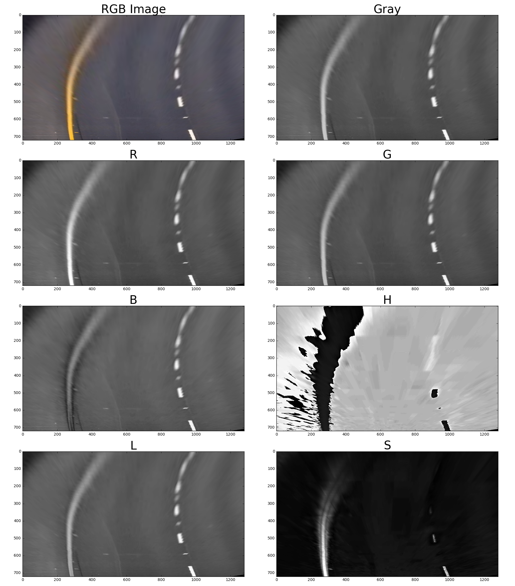

# Lane Finding Project

#### Udacity Self Driving Car Nanodegree Project #4


Leveraging camera data of the lane lines you are driving in-between can be really helpful for a self driving car. In this project I created a pipeline to take in an image (this could be a video frame) and highlight the area of the cars current lane. We also calculate useful information such as the curvature of the lanes (estimated in meters) as well as the offset distance from the center of the lane (this could be used to help a car stay centered in its lane). 

The first part of my pipeline is to undistort the input image coming from the cars camera. The cars camera may have slight distortions due to the curvature of its lens, so we have to account for this as we want accurate lane line data. We address this issue by computing a 'camera matrix' and some 'distortion coefficients', which can be used to undistort an image.


------

#### Criteria

*Briefly state how you computed the camera matrix and distortion coefficients.*
---

To compute the camera matrix and distortion coefficients, I utilized OpenCV's findChessboardCorners method to find the corners of the chessboards in 19/20 of the calibration images provided, and stored the image and object points (to later pass to calibrateCamera). I left 1/20 of the images of the calibration set out to use as a test image just as a sanity check to make sure my un-distortion was working. After passing my object and image points into the calibrateCamera method, I obtained the camera matrix and distortion coefficients. Using the new found matrix and set of coefficients, we can use them to leverage openCV's undistort method. 


<div class="fig figcenter fighighlight">


  <div class="figcaption">

    To the left is the unaltered image from a camera. To the right is the original image passed through a undistortion function. 
  </div>
</div>

#### Pipeline (test images)

*Distortion correction that was calculated via camera calibration has been correctly applied to each image.*
---

***(Code for this section can be found in the "advanced_lane_finding_functions.py" file, lines 1-16. As well as the  Section section in the jupyter notebook)***

<div class="fig figcenter fighighlight">

  
  <div class="figcaption">

```
 Example of a (presumably distorted) image
```

  </div>
</div>

<div class="fig figcenter fighighlight">
  
  <div class="figcaption">

```
 Example of an undistorted image
```

The distortion correction was calculated via camera calibration and has been applied to each image in the project.


---
#### Criteria
*A method or combination of methods (i.e., color transforms, gradients) has been used to create a binary image containing likely lane pixels. There is no "ground truth" here, just visual verification that the pixels identified as part of the lane lines are, in fact, part of the lines.*
---

***(Code for this section can be found in the "advanced_lane_finding_functions.py" file, lines 37-74, and 116-140. As well as the "Binary Image Prep" section in the jupyter notebook)***

*Before doing any color transformations (or any other combination of methods), I did a perspective transform on the image. (This will be discussed in the following section).*

If we take a look at an example image and how it appears in different color channels, we can see some channels are better at picking out colors than others. Here I have plotted the RGB and HLS color channels separately as well the Grayscale image. 

 </div>
</div>

<div class="fig figcenter fighighlight">
  
  <div class="figcaption">

```
Separate color channels.
```

  </div>
</div>

For this project, I used Grayscale image space, the R channel from the RGB color space and the S channel from the HLS color space. Originally, my code looked through all of the color spaces and tried to find which color space would give the clearest lines (automated by comparing measures of how well polyfit fit the data), but this was way too expensive to do for video, so I ended up selecting just the Grayscale, R channel, and S channel images. I hand-tuned the different thresholds for the S channel and Grayscale images, and combined their results to give me a single thresholded binary image. I also used sobel thresholds on the Gray, R and S channels to further ensure I obtain lane lines. 

Here is my example of a binary image result: 
#### Raw Transformed Pre-Binary Thresholded Image:

</div>
  </div>

  <div class="fig figcenter fighighlight">
  
  <div class="figcaption">

```
Raw transformed pre-filtered image
```

  </div>

</div>

We'll first observe the S channel contributions:

</div>
</div>

<div class="fig figcenter fighighlight">

<div class="figcaption">

```
S Channel (before binary threshold)
```

</div>
</div>  

</div>
</div>

<div class="fig figcenter fighighlight">

<div class="figcaption">

```
S channel after a Binary Threshold is applied
```

</div>
</div>

The main reason I am using the S channel, is because it does well (at least better than the other channels) at picking out yellow lane lines. I am not too worried that it is missing some of the right lane lines, since we are using a combination of other channels. 

We'll next observe the Grayscale contributions:

</div>
</div>

<div class="fig figcenter fighighlight">

<div class="figcaption">

```
Gray channel after Binary Threshold
```

</div>
</div>

Next, we'll combine these images to create a new binary image.

</div>
</div>

<div class="fig figcenter fighighlight">

<div class="figcaption">

```
Binary Thresholded Gray and S channels combined
```

</div>
</div>

G and S combined gives us better information than just any single color channel. I further tried to look for more useful filters of the G and S channel by utilizing the Sobel gradient filters. 

<div class="fig figcenter fighighlight">

<div class="figcaption">

```
Sobel applied to the S channel
```

</div>
</div>

<div class="fig figcenter fighighlight">


<div class="figcaption">

```
Sobel applied to the Grayscale image
```

</div>
</div>

<div class="fig figcenter fighighlight">

<div class="figcaption">

```
Combining Sobel applied to S and G
```

</div>
</div>

Although it appears as if the Sobel won't add much more information than previously extracted from the S and G color channels alone, it does help later when S and G struggle on their own. 

<div class="fig figcenter fighighlight">

<div class="figcaption">

```
Combining Sobel applied to S and G, as well as the Binary Thresholded S and G
```

</div>
</div>

*OpenCV function or other method has been used to correctly rectify each image to a "birds-eye view".*
---

***(Code for this section can be found in the "advanced_lane_finding_functions.py" file, lines 77-92. As well as the "Image Prep and Warp" Section section in the jupyter notebook)***

To do the perspective transform, I selected 4 static anchor points (or source points). In my previous version, I tried to look for the best anchor points for a specific frame, but it was way to expensive to apply to videos, and I learned that having static source points works very well. Instead of having the bottom anchor points be near the lane line, I decided to have them on the edge of the image.

<div class="fig figcenter fighighlight">

<div class="figcaption">

```
4 Anchor points for the perspective transformation
```

</div>
</div>

Using the "getPerspectiveTransform" function from OpenCV, I was able to get a transformation matrix M using the mentioned source/anchor points, as well a set of user defined "destination" points. We can use "getPerspectiveTransform" to get the inverse of M by switching the arguments of the source and destination points. 

<div class="fig figcenter fighighlight">

<div class="figcaption">

```
Example of transforming an image with the M matrix
```

</div>
</div>

Although we get a kind of skewed version of the lane lines due to the bottom of the source points being far from the lane lines, it turns out to be okay since this perspective allows us to extract separate information for the left and right lines. The transformation can be undone since we know exactly what the inverse of the transform matrix is. 

*Methods have been used to identify lane line pixels in the rectified binary image. The left and right line have been identified and fit with a curved functional form (e.g., spine or polynomial). Example images with line pixels identified and a fit overplotted should be included in the writeup (or saved to a folder) and submitted with the project.*
---

***(Code for this section can be found in the "advanced_lane_finding_functions.py" file, lines 142-293. As well as the "Fit Polynomial" Section section in the jupyter notebook)***

To start off, I created a Line class to hold all the useful information about the left and right lines. This is especially helpful later when we fit lines for sequences of frames (video). 

In order to get a good starting point for finding where the lines start, we take a look at the initial frame, and plot a histogram of the presence of active pixels for the X axis. We find where the peaks are for this histogram, and use that as a starting point for where to look for lane lines. 

Here we can see (in red) the presence of active pixels along the X-axis. 

<div class="fig figcenter fighighlight">

<div class="figcaption">

```
Histogram of active pixels along the y-axis
```

</div>
</div>

So I use the maxes of this histogram (left and right half, for the left and right lanes) as a starting points for where we begin searching for lane lines. 

First, I created a function "fit_poly_lanes()" which will take in instances for the left and right lines, as well as the warped undistorted image (it is important to pass an undistorted image in), and returns the left and right lines. The way this happens (starting on line 142 "advanced_lane_finding_functions.py") is it will look for surrounding pixels around the previously found bases from our histogram, and store pixels within a specified window. The image is also split into 9 sections along the y axis. For each of these sections, we determine if we need to update our bases depending on the active pixels in that window. After doing this 9 times, we will have extracted points within a specified window size for all 9 sections.

We then use the points found in these windows to fit a 2nd degree polynomial. 

<div class="fig figcenter fighighlight">

<div class="figcaption">

```
Example output from the fits found from the "fit_poly_lanes()" function
```

</div>
</div>

After we find the initial set of lines, we can then skip the step of splitting the image into 9 sections, and doing a search for pixels. We do this by leveraging the fact that adjacent frames in a video are not so different from each other, so we can use the previously found 2nd degree polynomial fit, and pad that to create a new area to search for points. 

This is done with the function "fit_next_lines()" (starting on line 233 of "advanced_lane_finding_functions.py") which takes in the left and right lane lines, as well as an image. This function is only to be called after the initial fit was created by "fit_poly_lanes()". This function will use an average of the coefficients of the previous fit, as well as the new current fit (of the points within the new padded window), and will update the lane lines accordingly. 

*Here the idea is to take the measurements of where the lane lines are and estimate how much the road is curving and where the vehicle is located with respect to the center of the lane. The radius of curvature may be given in meters assuming the curve of the road follows a circle. For the position of the vehicle, you may assume the camera is mounted at the center of the car and the deviation of the midpoint of the lane from the center of the image is the offset you're looking for. As with the polynomial fitting, convert from pixels to meters.*
---

***(Code for this section can be found in the "advanced_lane_finding_functions.py" file, lines 296-325. As well as the "Fit Curve" Section section in the jupyter notebook)***

In order to fit the curve, I simply followed the equation:

Curvature = $\Large \frac{(1+(2Ay+B)^2)^{1.5}}{2A}$

For Y, I used the value 40, since it should be in "real world" units (m). I found the pixel to meter conversion factors by estimating the road length and width in meters, and took the ratio of the number of pixels they occupied. I then had to refit new polynomials with the adjusted variables in meters rather than pixels. 

I used the fit polynomials to solve for when the image is at the max y value (The bottom of the image), to find the base of each line. I used this information to find where the center of the lane is located, so that I could also measure the deviation of the midpoint of the lane from the center of the image.

<div class="fig figcenter fighighlight">

<div class="figcaption">

```
Example of the curvature found, as well as the relative distance from the center (assuming 0 is perfectly centered). The lane lines are detected and are plotted back (after going through the previously described functions to fit polynomials) onto the road with the inverse transformation matrix.
```

</div>
</div>

And here is the result plotted back down (after going through the previously described functions to fit polynomials) onto the road with the inverse transformation:

<div class="fig figcenter fighighlight">

<div class="figcaption">

```
Example of resulting output of the final pipeline
```

</div>
</div>

#### Pipeline (video)

*The image processing pipeline that was established to find the lane lines in images successfully processes the video. The output here should be a new video where the lanes are identified in every frame, and outputs are generated regarding the radius of curvature of the lane and vehicle position within the lane. The pipeline should correctly map out curved lines and not fail when shadows or pavement color changes are present.*
---

Link to my final video output: https://youtu.be/kW9rJdLdAgI

I leveraged averages of lane line coefficients to smoothen lane line transitions between frames.

#### Discussion

*Discussion includes some consideration of problems/issues faced, what could be improved about their algorithm/pipeline, and what hypothetical cases would cause their pipeline to fail.*
---

My implementation will struggle if there are extra lines that might be picked up in between the actual lane lines. One way to address this problem is to be smarter about how I decide where my source points are, as well as making a smarter mask to block out unwanted information. In my previous implementation, I had an automated way of finding which color channels worked best, by fitting lines to every color channel, and seeing which one led to the best fit. I had to scrap the idea since it took way too long doing it frame by frame for an entire video. Other hypothetical situations where my implementation would fail is if a car moved into the space directly in front of the camera view, blocking the lane lines for a short period of time. This would confuse my implementation since it leverages looking for lane lines. One possible solution to this is to use a larger number of frames to average (rather than my current implementation of using the average of the past 2 lane lines). Another thing that might improve the quality of the lines is if I made the length of the lane lines detected shorter, leaving less room for error. 
